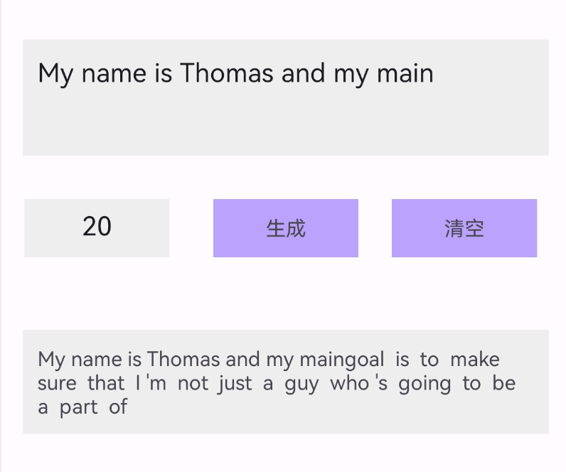

### 安卓端部署运行GPT-2

- 将[GPT-2](https://huggingface.co/openai-community/gpt2)模型转换为`.tflite`格式，`.tflite`格式是 [TensorFlow Lite](https://tensorflow.google.cn/lite?hl=zh-cn) 标准使用的一种格式

- 使用`TensorFlow Lite`进行安装集成

### 主要步骤

- TensorFlow Lite依赖：模块级build.gradle

    ```
        // TensorFlow Lite依赖
        implementation 'org.tensorflow:tensorflow-lite:2.8.0'
        // 在build.gradle中启用TF Select
        implementation 'org.tensorflow:tensorflow-lite-select-tf-ops:2.8.0'
    ```

- Kotlin支持：项目级build.gradle

    ```
    buildscript {
        repositories {
            google()
            mavenCentral()
        }
        dependencies {
            classpath "org.jetbrains.kotlin:kotlin-gradle-plugin:1.9.10"
        }
    }

    模块级build.gradle
    apply plugin: 'kotlin-android'
    ```

- 模型导入

    ```
    main下新建assets目录，将模型 .tflite 文件、编码文件、词汇文件放入assets目录
    详见：项目中的assets目录
    ```

- 运行效果

    

本项目使用的是GPT-2模型，也可以从 [huggingface](https://huggingface.co/models) 下载其他模型集成，部分模型会包含已经转换好的 `.tflite` 格式模型，自己转换的话可以参照 [gpt2_to_tflite](https://github.com/swxctx/gpt2_to_tflite)，不同的模型会有所不同，需要按照实际转换的模型调整脚本参数。